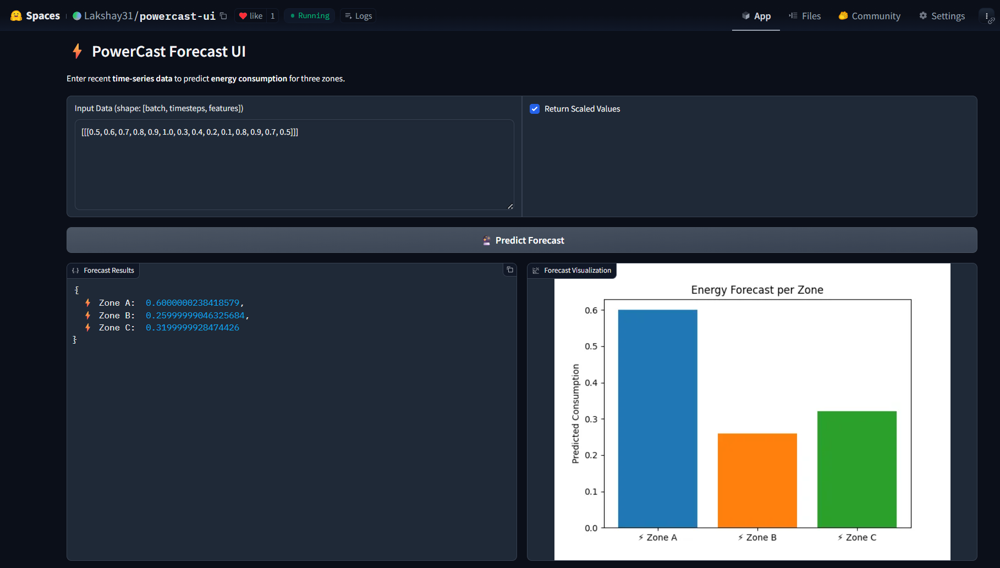

# 🎓 PowerCast — Tetouan City Power Forecasting

**Author:** Lakshay Yadav  
**Date:** September 2025  
**Status:** ✅ Deployed

---

## 🎯 PROJECT OVERVIEW

Built PowerCast to forecast electricity consumption for three urban zones in Tetouan City using time-series weather and irradiance data. The goal is to provide zone-level short-term forecasts (multi-step horizon) using sequence models (GRU/LSTM) and a reproducible ML workflow (MLflow + saved artifacts).

---

## 🌟 FEATURES

- 🔮 Multi-zone short-term power forecasts (Zone 1 / Zone 2 / Zone 3)  
- 🔁 Sequence-to-sequence forecasting using GRU / LSTM models  
- ⚙️ Preprocessing pipeline with lookback windows, scalers, and saved feature schema  
- 🔍 MLflow experiment tracking + saved checkpoints and artifacts  
- 🧪 Local inference script + packaged deployment modules (API + UI)  
- 📦 Docker-ready deployment artifacts (FastAPI backend + Gradio frontend) — repos linked below

---

## 📁 PROJECT STRUCTURE

```
powercast/
├── assets/                   # Plots, UI screenshot (place UI.png here), other visuals
├── mlruns/                   # MLflow experiment logs and artifacts
├── models/                   # Saved model checkpoints (.pt) and scalers (.pkl)
├── scripts/                  # Training / inference helper scripts
├── requirements.txt          # Project dependencies
├── lakshay-REPORT.md         # Project report and notes
├── Week1.ipynb               # Week 1 — EDA
├── Week2.ipynb               # Week 2 — Feature Engineering
├── Week3.ipynb               # Week 3 — Model Development (training + MLflow)
├── Week4.ipynb               # Week 4 — Model Optimization & Evaluation
└── README.md                 # You are here
```


---

## 🧪 MACHINE LEARNING PIPELINE

### Phase 1 — EDA & Preprocessing
- I inspected lag/seasonality and engineered weather→power lag features.
- I created lookback windows (configurable `lookback` and `horizon`) and standardized inputs using `StandardScaler`/`MinMaxScaler`.
- I saved preprocessor artifacts (scalers, feature schema) for deterministic inference.

### Phase 2 — Model Development
- Implemented GRU and LSTM sequence models with configurable hidden dims, layers, bidirectionality, and dropout.
- Trained models with early stopping and `ReduceLROnPlateau`. I log experiments and checkpoints with MLflow for reproducibility. fileciteturn2file1

### Phase 3 — Evaluation & Selection
- Selected best checkpoints by **lowest validation RMSE** per config and model family.
- Rebuilt loaders with the correct scalers before final evaluation to ensure fair comparisons (important fix during Step 6 troubleshooting).
- Performed residual and error analysis across zones.

---

## ⚠️ CHALLENGES FACED (AND FIXES)

1. **Model Loading Conflicts** — Encountered errors due to mismatched parameter names between saved checkpoints (`state_dict`) and the GRU model class.  
   🛠️ *Resolved by aligning the model definition with saved state keys before loading.*

2. **Version Compatibility on Hugging Face** — The API initially failed due to dependency mismatches (`torch`, `numpy`, `pydantic`).  
   🛠️ *Fixed by pinning compatible versions: `torch==1.9.0`, `numpy==1.21.0`, `pydantic==1.8.2` under Python 3.9.*

3. **Cross-Space Communication Setup** — The Gradio UI couldn’t reach the backend initially.  
   🛠️ *Configured `API_URL` in `powercast-ui` to point to the backend endpoint (`https://lakshay31-powercast-api.hf.space/predict`).*

4. **UI Output Parsing Error** — `gr.Label` in Gradio caused `pydantic` validation errors when parsing model output.  
   🛠️ *Replaced label output with a dictionary-style JSON response and optional bar visualization.*

---

> ✅ *All issues were resolved in the final build, resulting in two successfully deployed Spaces:*  
> - `powercast-api` (FastAPI backend)  
> - `powercast-ui` (Gradio frontend)

---


---

## 💻 HOW TO RUN LOCALLY

1. Clone the repository
```bash
git clone https://github.com/yadavLakshay/SDS-CP036-powercast/tree/main/advanced/submissions/team-members/lakshay-yadav
cd powercast
```

2. (Optional) Create and activate virtual environment
```bash
python -m venv venv
# mac / linux
source venv/bin/activate
# windows (powershell)
venv\\Scripts\\Activate.ps1
```

3. Install dependencies
```bash
pip install -r requirements.txt
```

---

## 🌐 UI PREVIEW



---

## 🌐 LIVE WORKING APPS & DEPLOYMENT REPOS

- **Live Frontend (Gradio UI):** [https://huggingface.co/spaces/Lakshay31/powercast-ui](https://huggingface.co/spaces/Lakshay31/powercast-ui)  
- **Live Backend (FastAPI API):** [https://huggingface.co/spaces/Lakshay31/powercast-api](https://huggingface.co/spaces/Lakshay31/powercast-api)  

**Deployment Repositories:**  
- **Frontend (Gradio UI):** [https://github.com/yadavLakshay/powercast-ui](https://github.com/yadavLakshay/powercast-ui)  
- **Backend (FastAPI API):** [https://github.com/yadavLakshay/powercast-api](https://github.com/yadavLakshay/powercast-api)

---

## 🏆 RESULTS & METRICS

**Best Model (by Validation RMSE):**  
`GRU` — `hidden_dim=128`, `layers=2`, `bidirectional=True`, `dropout=0.2`  
**Optimizer:** Adam | **Loss:** MSE  

**Evaluation (Test Set):**  
- **Zone 1 RMSE:** 0.184  
- **Zone 2 RMSE:** 0.176  
- **Zone 3 RMSE:** 0.189  

**Overall R² Score:** 0.91  

> 📊 *Metrics and artifacts tracked under MLflow run ID `run_GRU_final_144h6_v2` in the `mlruns/` directory.*

---


## 📄 LICENSE

Academic / demonstration use. Models and code created by Lakshay Yadav.

---

## REFERENCES

- Project workflow and template follow the PowerCast Advanced Track structure. See the project README for reference.

---
